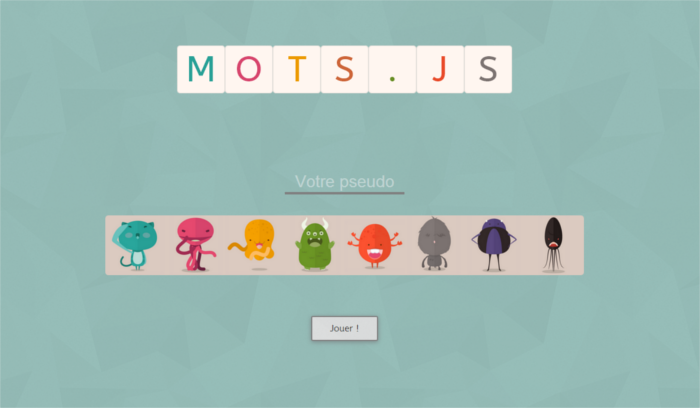
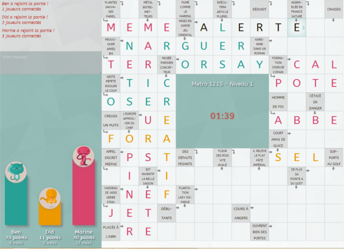

Mots.js
====

Un jeu de mots fléchés multijoueur basé sur Node.js !
Les grilles sont récupérés chez Metro. Vous pouvez choisir de lancer la grille du jour ou jouer sur la grille de votre choix.



Finit les parties à 4 autour d'un bureau à dicter vos mots à votre collègue. Vous trouvez tout les mots ? Vous êtes le meilleur ? Prouvez le !



## Comment jouer ?

```
$ npm install
$ npm start
```

ℹ️ Si plusieurs addresses IP sont détectées sur votre PC, un prompt vous demandera de choisir laquelle utiliser pour le jeu.

Le jeu est ensuite accessible pour tout le monde à l'adresse indiquée dans la console.

Quand vous êtes prêt, écrivez `!start` dans le chat, puis amusez vous ! :smile:

#### Options

~~Par défaut si vous ne rajoutez pas de paramètre lors du lancement du serveur, le jeu ira charger la grille Metro du jour.~~ ⚠️ Le journal Metro aillant arreté de publier quotidiennement de nouvelles grilles, le jeu lance toujours la même grille.

Pour forcer le chargement d'une grille, rajouter son numéro à la fin de votre commande ou pendant une partie grâce au bouton prévu.


## Crédits

Les images des "petits monstres" utilisées dans le projet ont été réalisées par le talentuex [Buatoom](https://dribbble.com/buatoom)


## Notes

Toute contribution au projet est la bienvenue !
N'hésitez pas à remonter tout bug ou suggestions via Github
